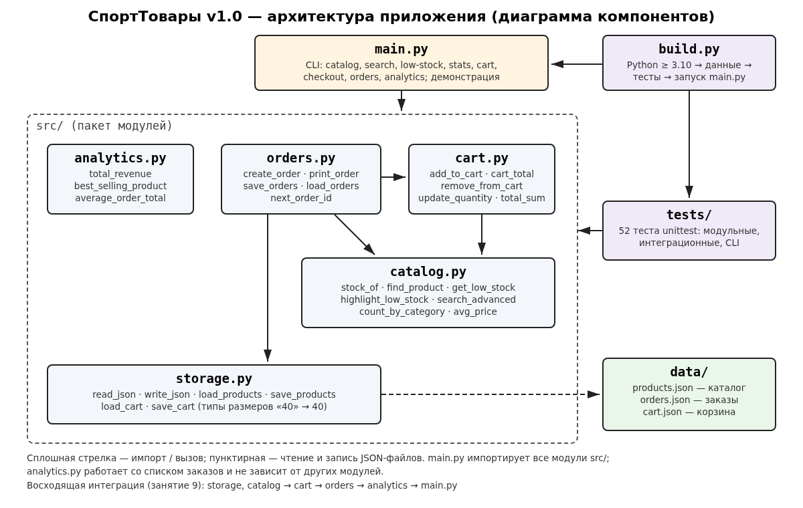
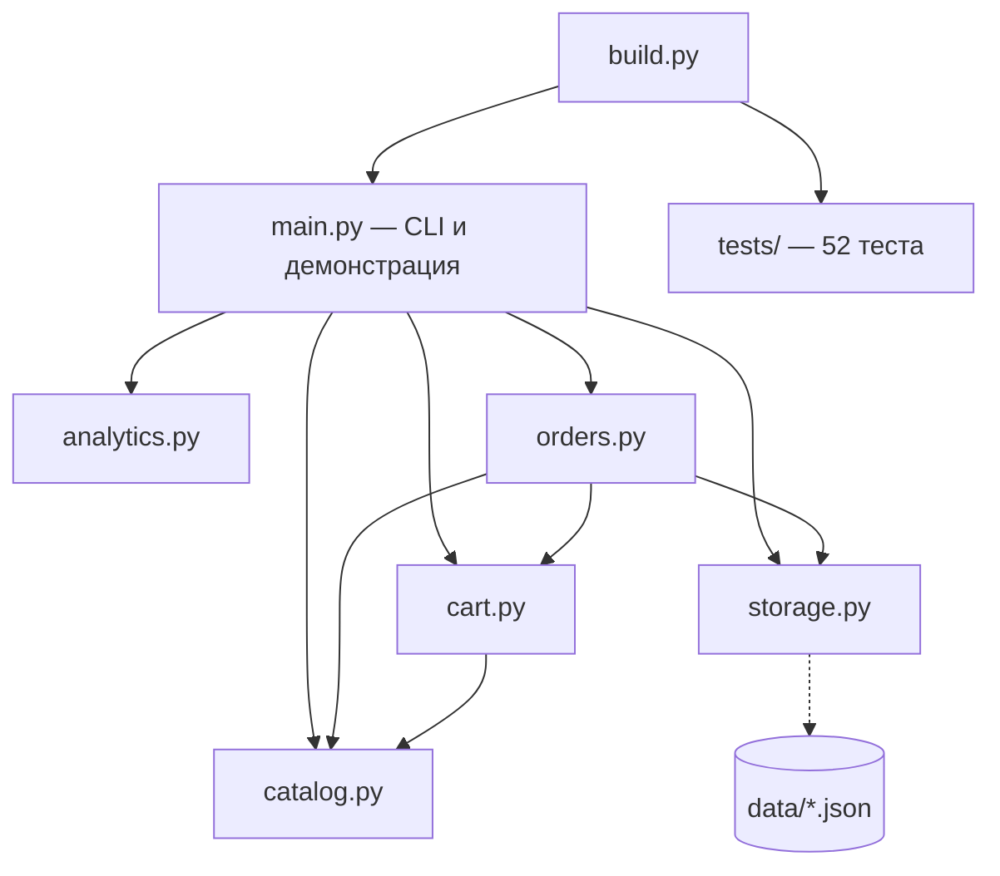

# 21. Презентация проекта «СпортТовары»

Формат: 7 слайдов, выступление 5–7 минут. Под каждым слайдом — текст выступления (заметки
докладчика) и ориентировочное время. Слайды можно показывать прямо из этого файла на GitHub
или в режиме предпросмотра Markdown в VS Code (`Ctrl+Shift+V`).

---

# Слайд 1. Титульный

## СпортТовары — система управления магазином

**Итоговый проект учебной практики**  
УП.02 «Осуществление интеграции программных модулей»

Автор: **Лаптев Василий Иванович**, группа **3ИП7-24**  
Версия: **1.0** · Репозиторий: <https://github.com/reflektpro/SportShop> · тег `v1.0`  
Москва, 2026

> 🎤 *0:00–0:30.* Здравствуйте. Меня зовут Василий Лаптев, группа 3ИП7-24. Я представляю итоговый
> проект практики — консольную систему управления магазином спортивных товаров «СпортТовары».
> Проект прошёл путь от бэклога в Scrum до релиза версии 1.0 с тестами, сборкой и документацией.

---

# Слайд 2. Цель и задачи

**Цель:** разработать работающее приложение для учёта товаров и продаж небольшого спортивного
магазина, применяя командные практики разработки, Git Flow, тестирование и интеграцию модулей.

**Задачи:**

1. Сформировать Product Backlog и спланировать спринт (Scrum, Kanban) — занятие 6.
2. Организовать работу с Git по модели Git Flow: feature, конфликты, Pull Request, hotfix — занятие 7.
3. Покрыть код модульными тестами и освоить отладку — занятие 8.
4. Разделить монолит на модули, написать интеграционные тесты и скрипт сборки — занятие 9.
5. Подготовить документацию, провести итоговое тестирование и выпустить релиз v1.0 — занятие 10.

> 🎤 *0:30–1:15.* Магазину нужно знать, что есть на складе по размерам, быстро находить товар,
> оформлять заказы и видеть выручку. Задачи проекта повторяют этапы практики — каждое занятие
> добавляло к продукту новый слой: процесс, контроль версий, тесты, архитектуру и документацию.

---

# Слайд 3. Архитектура





- 5 модулей пакета `src/` с одной ответственностью каждый; циклических зависимостей нет.
- Данные — JSON (`products.json`, `orders.json`, `cart.json`), без внешних библиотек.
- Интеграция — восходящая: `storage`, `catalog` → `cart` → `orders` → `analytics` → `main.py`.

> 🎤 *1:15–2:15.* Изначально весь код был в одном файле shop.py. На девятом занятии он разделён
> на пять модулей. Нижний уровень — каталог и хранилище, они ни от кого не зависят. Корзина
> использует каталог, заказы — корзину, каталог и хранилище. main.py — тонкий слой интерфейса.
> Скрипт build.py проверяет окружение, запускает тесты и приложение.

---

# Слайд 4. Основные функции

| Возможность | Функции API | Команда |
|---|---|---|
| Каталог и статистика | `avg_price`, `count_by_category`, `stock_of` | `catalog`, `stats` |
| Поиск | `search_advanced` (строка, категория, цена) | `search` |
| Контроль остатков | `get_low_stock`, `highlight_low_stock` | `low-stock` |
| Корзина | `add_to_cart`, `update_quantity`, `remove_from_cart`, `cart_total` | `cart add/set/remove/show` |
| Заказы | `create_order`, `print_order`, `next_order_id` | `checkout` |
| Хранение | `save_orders`, `load_orders`, `load_products`, `save_cart` | `orders --export/--file` |
| Аналитика | `total_revenue`, `average_order_total`, `best_selling_product` | `analytics` |

Всего 26 публичных функций — все описаны в [17_API_Reference.md](17_API_Reference.md).

> 🎤 *2:15–3:15.* Ключевая особенность предметной области — остатки по размерам: у кроссовок
> размеры 40–43, у футболок S–L. Корзина не даст положить несуществующий размер или больше
> товара, чем есть. Заказ сначала проверяет все остатки и только потом списывает, поэтому
> склад не уходит в минус даже при ошибке.

---

# Слайд 5. Демонстрация

```text
$ python main.py --data demo_data search nike
 ID  Название             Бренд    Категория     Цена  Остаток  Размеры
  1  Кроссовки RunFast    Nike     Обувь         8990        4  40: 2, 41: 1, 42: 1, 43: 0
  4  Футболка DryFit      Nike     Одежда        2990        3  M: 2, L: 1
Найдено: 2
$ python main.py --data demo_data cart add 1 40 2
[+] «Кроссовки RunFast» (размер 40) добавлен в корзину
Корзина:
  [1] Кроссовки RunFast (размер 40) × 2 = 17980 руб.
  Итого: 17980 руб.
$ python main.py --data demo_data checkout --client "Лаптев В.И."
Заказ №1 от 2026-10-09 09:40, клиент: Лаптев В.И.
  Кроссовки RunFast (размер 40) × 2 = 17980 руб.
  Итого: 17980 руб.
Заказ сохранён в orders.json, остатки на складе обновлены.
$ python main.py --data demo_data analytics
Заказов: 1
Выручка: 17980 руб.
Средний чек: 17980.0 руб.
Хит продаж: Кроссовки RunFast
```

Сценарий живой демонстрации (≈ 1,5 мин): `catalog` → `search nike` → `cart add 1 40 2` →
`cart add 4 XL` (ошибка размера) → `checkout` → `search RunFast` (остаток уменьшился) → `analytics`.

> 🎤 *3:15–4:45.* Показываю работу в терминале на копии данных. Ищем Nike, кладём две пары
> кроссовок 40-го размера, пробуем несуществующий размер XL — программа отказывает. Оформляем
> заказ — остаток 40-го размера стал ноль, а аналитика сразу видит выручку.

---

# Слайд 6. Результаты тестирования

| Показатель | Значение |
|---|---|
| Автотестов | **52**: каталог 12, корзина 12, заказы и хранилище 6, аналитика 6, интеграционные 3, CLI и API v1.0 13 |
| Результат `unittest` | **OK**, 0 провалов, 0 ошибок |
| Сборка `build.py` | **СБОРКА УСПЕШНА** (4/4 шага) |
| Ручные сценарии | **15/15** пройдено |
| Найдено и исправлено ошибок за практику | `cart_total` без количества (hotfix, зан. 7), `update_quantity(0)` (тест, зан. 8), типы размеров из JSON (интеграция, зан. 9), нумерация заказов и пустой клиент (зан. 10) |

Подробности — [20_Final_Test_Report.md](20_Final_Test_Report.md).

> 🎤 *4:45–5:45.* Число тестов росло с каждым занятием: 21 → 39 → 52. Каждая найденная ошибка
> закреплена тестом, чтобы она не вернулась. Сборка одной командой проверяет всё: версию
> Python, данные, тесты и запуск приложения.

---

# Слайд 7. Выводы

**Что получилось:**

- рабочее приложение v1.0 с консольным интерфейсом и модульной архитектурой;
- 52 автотеста и сборка одной командой;
- полная документация: README, API, руководства пользователя и разработчика, отчёт о тестировании;
- история разработки по Git Flow с тегами `practice-6 … practice-10` и релизом `v1.0`.

**Планы на будущее:**

1. Хранение данных в SQLite вместо JSON (опыт есть по проекту StudyOS).
2. Графический или веб-интерфейс (Flask) поверх того же API.
3. Непрерывная интеграция: запуск `build.py` в GitHub Actions на каждый Pull Request.
4. Скидки, возвраты, учёт поставок.

> 🎤 *5:45–6:30.* Главный вывод: разделение на модули, тесты и документация сделали проект
> управляемым — новую функцию можно добавить по инструкции из руководства разработчика за
> несколько минут, не боясь сломать старое. Спасибо за внимание, готов ответить на вопросы.
