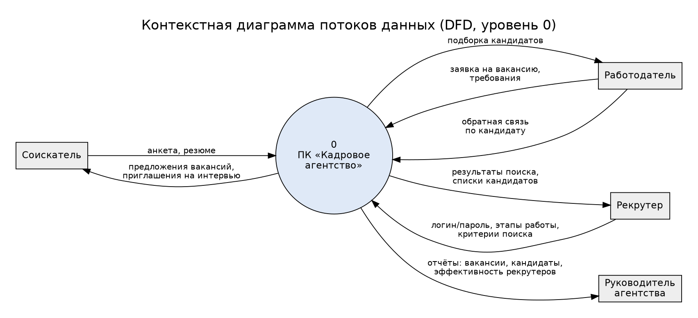
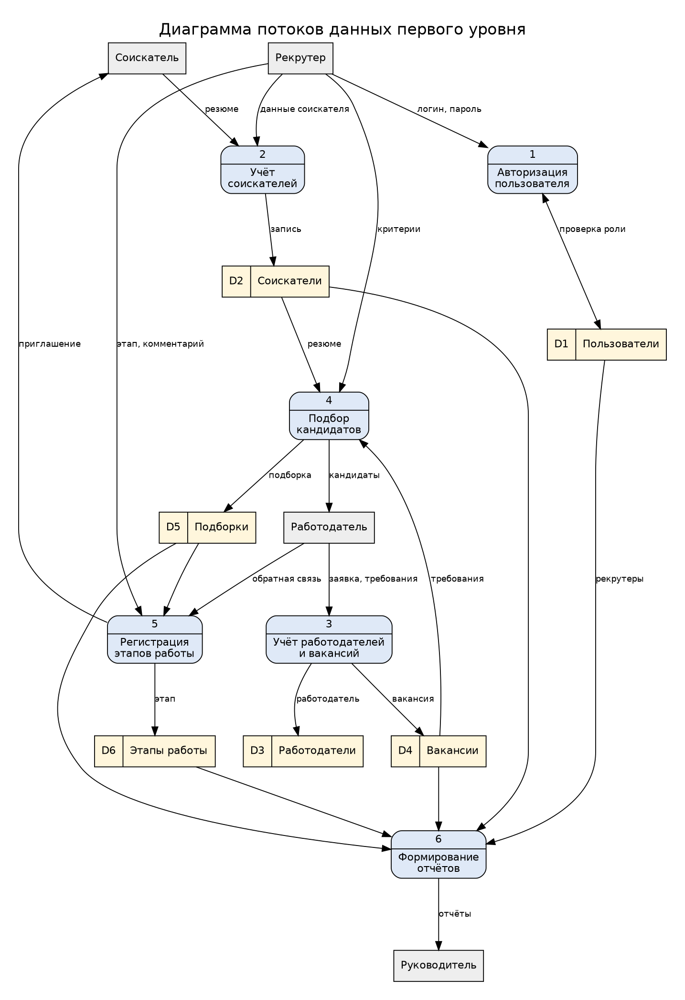
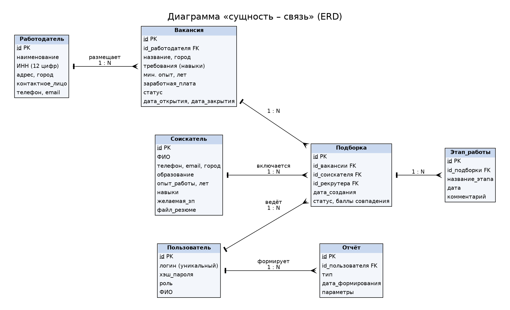

# Практическая работа № 3. Задание 1. Эскизный проект

**Программный комплекс «Кадровое агентство»** (ПК КА)  
Основание: техническое задание из практической работы № 2 ([02_Technical_Specification.md](02_Technical_Specification.md)).  
Разработал: Лаптев В.И., группа 3ИП7-24. Дата: 09.10.2026.

## 1. Постановка задачи

Кадровое агентство (предметная область выбрана в практической работе № 1, см.
[01_Domain_Analysis.md](01_Domain_Analysis.md)) ведёт учёт соискателей, работодателей и
вакансий вручную: в электронных таблицах и переписке. Из-за этого резюме теряются, кандидатов
на вакансию подбирают «по памяти», а руководитель не видит, сколько вакансий закрыто и как
работает каждый рекрутер. Требуется на основе ТЗ выполнить анализ требований, принять основные
технические решения и описать их в виде эскизного проекта: спецификации процессов, диаграммы
потоков данных, диаграмма «сущность – связь» и словарь терминов.

## 2. Ведомость эскизного проекта

| № | Документ | Где находится |
|---|---|---|
| 1 | Пояснительная записка (разделы 3–5 этого документа) | `03_Sketch_Project.md` |
| 2 | Спецификации процессов (раздел 6) | `03_Sketch_Project.md` |
| 3 | Контекстная диаграмма потоков данных | [diagrams/dfd_context.png](diagrams/dfd_context.png) |
| 4 | Диаграмма потоков данных первого уровня | [diagrams/dfd_level1.png](diagrams/dfd_level1.png) |
| 5 | Диаграмма «сущность – связь» | [diagrams/erd.png](diagrams/erd.png) |
| 6 | Словарь терминов (раздел 9) | `03_Sketch_Project.md` |

Исходные тексты диаграмм – файлы `diagrams/*.dot` (Graphviz), изображения получены командой
`dot -Tpng файл.dot -o файл.png`.

## 3. Анализ функциональных требований

Требования ТЗ сгруппированы по подсистемам; для каждого указан приоритет (MoSCoW: M – must,
S – should, C – could) и решение эскизного проекта.

| № | Требование ТЗ | Подсистема | Приоритет | Решение |
|---|---|---|---|---|
| Ф1 | Ведение справочника вакансий (CRUD, статус, даты, зарплата) | Справочники | M | таблица `vacancy`, статусы «открыта / приостановлена / закрыта» |
| Ф2 | Ведение справочника соискателей (ФИО, контакты, образование, опыт, навыки, резюме, желаемая зп) | Справочники | M | таблица `applicant`; файл резюме хранится в папке `resumes/`, в БД – путь |
| Ф3 | Ведение справочника работодателей (ИНН, адрес, контактное лицо) | Справочники | M | таблица `employer`, проверка ИНН (10 или 12 цифр) |
| Ф4 | Пользователи, роли, разграничение прав | Авторизация | M | таблица `user`, роли «администратор / руководитель / рекрутер», пароль – хэш SHA-256 с солью |
| Ф5 | Поиск вакансий и резюме по названию, работодателю, ключевым словам, зарплате, опыту, городу | Поиск и подбор | M | один универсальный фильтр с необязательными критериями |
| Ф6 | Подборка кандидатов: автосопоставление, ручное добавление, сохранение | Поиск и подбор | M | алгоритм балльной оценки (см. технический проект), таблица `selection` |
| Ф7 | Этапы работы с кандидатом (контакт → интервью → тестирование → направление → обратная связь → приём) | Этапы работы | M | таблица `stage`, этапы проходят строго по порядку |
| Ф8 | Отчёты: открытые и закрытые вакансии, кандидаты, работодатели, эффективность рекрутеров | Отчётность | S | SQL-выборки + вывод таблицей |
| Ф9 | Экспорт в CSV, XLSX, PDF; импорт CSV, XLSX | Импорт/экспорт | S (CSV), C (XLSX, PDF) | CSV – стандартная библиотека; XLSX/PDF – библиотеки openpyxl, reportlab во второй очереди |
| Ф10 | Журналирование действий пользователей | Авторизация | S | таблица `audit_log` |

## 4. Анализ эксплуатационных требований

| Требование ТЗ | Значение | Как обеспечивается |
|---|---|---|
| Время отклика поиска | ≤ 3 с | индексы по `vacancy.status`, `applicant.city`, `applicant.experience`; объём – тысячи записей |
| Формирование отчёта | ≤ 10 с | агрегирующие SQL-запросы, без загрузки всей базы в память |
| Сохранение записи | ≤ 2 с | одна транзакция на операцию |
| Загрузка системы | ≤ 15 с | приложение без тяжёлых зависимостей |
| Восстановление после сбоя | ≤ 30 мин | ежедневное резервное копирование файла БД, журнал транзакций СУБД |
| Целостность данных | обязательно | внешние ключи, `ON DELETE RESTRICT` для работодателя с вакансиями |
| Режимы работы | локальный и сетевой | SQLite – однопользовательский режим; PostgreSQL – сетевой |
| Технические средства | Core i3, 4 ГБ ОЗУ, 2 ГБ диска, 1366×768 | требования минимальны, Python-приложение помещается с запасом |
| Защита персональных данных (152-ФЗ) | обязательно | хэширование паролей, роли, журнал доступа, хранение БД на защищённом сервере |

## 5. Основные технические решения

### 5.1. Выбор метода решения и языка программирования

| Критерий | Python 3.10+ | C# (.NET) | Java |
|---|---|---|---|
| Работа на Windows и Linux (ТЗ) | да | да (.NET 6+) | да |
| Встроенная поддержка SQLite | да (`sqlite3`) | пакет NuGet | драйвер JDBC |
| Скорость разработки, объём кода | высокая | средняя | ниже |
| Опыт команды (занятия 1–2, 6–9) | есть | нет | нет |
| Тестирование | `unittest` встроен | NUnit/xUnit | JUnit |

**Решение:** язык **Python 3.10+**; метод – **объектно-ориентированный** для предметной модели
(классы «Вакансия», «Соискатель», «Работодатель», «Подборка» – см. работу № 4) и
**структурный** (нисходящее проектирование, пошаговая детализация) для алгоритмов подбора и отчётов.
СУБД – **SQLite** для однопользовательского режима и разработки, **PostgreSQL** для сетевого режима
(как определено в работе № 1); доступ к данным изолирован в одном модуле, поэтому смена СУБД
не затрагивает остальной код.

### 5.2. Структура программного продукта

Модульная, трёхуровневая: интерфейс (формы/консоль) → бизнес-логика (подсистемы) → доступ к данным.
Подсистемы: авторизация, ведение справочников, поиск и подбор, учёт этапов работы, отчётность,
импорт/экспорт. Структурная схема приведена в техническом проекте
([03_Technical_Project.md](03_Technical_Project.md)).

### 5.3. Состав функций программного продукта

Ф1–Ф10 из раздела 3; первая очередь – Ф1–Ф7 и CSV-экспорт, вторая очередь – отчёты в XLSX/PDF и импорт.

### 5.4. Режимы функционирования

| Режим | Описание |
|---|---|
| Рабочий | сотрудники работают с данными в пределах своей роли |
| Администрирование | администратор управляет пользователями, ролями, справочниками статусов |
| Отчётный | руководитель формирует отчёты, редактирование недоступно |
| Сервисный | резервное копирование и восстановление БД, просмотр журнала |
| Аварийный | при недоступности БД приложение сообщает об ошибке и не теряет введённые данные (форма не закрывается) |

## 6. Спецификации процессов

Спецификации даны для процессов DFD первого уровня в виде структурированного текста (псевдокода).

**Процесс 1. Авторизация пользователя.**  
Вход: логин, пароль. Выход: роль пользователя или отказ.
```
найти пользователя по логину
ЕСЛИ не найден ИЛИ хэш(пароль + соль) ≠ сохранённый хэш ТО
    увеличить счётчик неудачных попыток; ЕСЛИ попыток ≥ 5 ТО заблокировать на 5 минут
    вернуть «неверный логин или пароль»
записать вход в журнал; вернуть роль
```

**Процесс 2. Учёт соискателей.**  
Вход: анкета (ФИО, телефон, email, город, образование, опыт, навыки, желаемая зп, файл резюме).
Выход: запись в D2 или список ошибок.
```
проверить обязательные поля (ФИО, телефон); проверить формат email; опыт ≥ 0; зп > 0
ЕСЛИ есть ошибки ТО вернуть список ошибок
ЕСЛИ соискатель с тем же телефоном уже есть ТО предложить обновить запись
сохранить запись в D2; записать действие в журнал
```

**Процесс 3. Учёт работодателей и вакансий.**  
Вход: данные работодателя, заявка на вакансию. Выход: записи в D3, D4.
```
проверить ИНН (10 или 12 цифр, уникален); сохранить работодателя в D3
для заявки: проверить название, зп > 0, мин. опыт ≥ 0; статус ← «открыта»; дата_открытия ← сегодня
сохранить вакансию в D4
при закрытии вакансии: статус ← «закрыта», дата_закрытия ← сегодня
```

**Процесс 4. Подбор кандидатов.**  
Вход: вакансия, критерии/порог. Выход: подборка (D5), список кандидатов работодателю.
```
ЕСЛИ вакансия не открыта ТО отказ
ДЛЯ КАЖДОГО соискателя: score ← оценка(навыки, опыт, зп, город)   (алгоритм – в техпроекте)
оставить соискателей с score ≥ порога; отсортировать по убыванию score
сохранить подборку в D5 со статусом «сформирована»; рекрутер может добавить кандидата вручную
```

**Процесс 5. Регистрация этапов работы.**  
Вход: подборка, этап, комментарий. Выход: запись в D6, приглашение соискателю.
```
порядок этапов: контакт → интервью → тестирование → направление → обратная связь → приём
ЕСЛИ новый этап не следующий по порядку ТО отказ («нельзя перескочить этап»)
сохранить этап с датой; ЕСЛИ этап = «приём» ТО вакансия.статус ← «закрыта»
```

**Процесс 6. Формирование отчётов.**  
Вход: тип отчёта, период. Выход: таблица на экран или файл CSV.
```
ВЫБОР тип
    «открытые вакансии»: вакансии со статусом «открыта», сгруппировать по работодателю
    «кандидаты»: соискатели с числом подборок и последним этапом
    «эффективность рекрутеров»: по каждому рекрутеру – подборок, приёмов, конверсия = приёмы / подборки
вывести таблицу; при запросе – экспорт в CSV
```

## 7. Диаграммы потоков данных

Внешние сущности: **соискатель**, **работодатель**, **рекрутер**, **руководитель агентства**.
Контекстная диаграмма показывает систему как один процесс и все потоки с внешней средой
(совпадают с информационными потоками, описанными в работе № 1).



Диаграмма первого уровня детализирует систему на 6 процессов и 6 хранилищ данных
(D1 «Пользователи», D2 «Соискатели», D3 «Работодатели», D4 «Вакансии», D5 «Подборки», D6 «Этапы работы»).



## 8. Диаграмма «сущность – связь»

Программный продукт содержит базу данных, поэтому построена ERD (на основе приложения А ТЗ).
Нотация: «вороньи лапки» на стороне «многие», засечка – на стороне «один».



| Связь | Тип | Правило |
|---|---|---|
| Работодатель – Вакансия | 1 : N | у вакансии ровно один работодатель; работодателя с вакансиями удалить нельзя |
| Вакансия – Подборка | 1 : N | на одну вакансию – много записей подборки |
| Соискатель – Подборка | 1 : N | соискатель может быть в подборках разных вакансий (связь M : N вакансий и соискателей через подборку) |
| Пользователь – Подборка | 1 : N | подборку ведёт один рекрутер |
| Подборка – Этап_работы | 1 : N | история этапов по кандидату на вакансию |
| Пользователь – Отчёт | 1 : N | кто и когда сформировал отчёт |

Сущность «Подборка» в ТЗ была описана как запись «вакансия – соискатель»; в эскизном проекте в
неё добавлены `id_рекрутера` (нужно для отчёта об эффективности рекрутеров – требование Ф8) и
`баллы совпадения` (результат автоподбора).

## 9. Словарь терминов

| Термин | Определение | Тип / формат данных |
|---|---|---|
| Соискатель (кандидат) | физическое лицо, ищущее работу через агентство | запись D2 |
| Работодатель | организация, размещающая заявку на подбор персонала | запись D3; ИНН – строка из 10 или 12 цифр |
| Вакансия | свободное рабочее место у работодателя с требованиями и зарплатой | запись D4 |
| Статус вакансии | состояние вакансии | перечисление: «открыта», «приостановлена», «закрыта» |
| Требования вакансии | набор навыков, которыми должен владеть кандидат | множество строк, регистр не учитывается |
| Навыки соискателя | профессиональные умения соискателя | множество строк |
| Опыт работы | стаж по специальности | целое число лет ≥ 0 |
| Заработная плата / желаемая зп | предлагаемый / ожидаемый доход в месяц | целое число рублей > 0 |
| Подборка | связь «вакансия – соискатель», сформированная рекрутером | запись D5 |
| Балл совпадения (score) | числовая оценка соответствия соискателя вакансии | целое 0–100 |
| Порог подбора | минимальный балл для включения в подборку | целое, по умолчанию 50 |
| Этап работы | шаг взаимодействия с кандидатом | перечисление из 6 этапов (процесс 5) |
| Рекрутер | сотрудник агентства, ведущий подбор | пользователь с ролью «рекрутер» |
| Конверсия рекрутера | доля подборок, закончившихся приёмом на работу | приёмы / подборки, % |
| Роль | набор прав пользователя | «администратор», «руководитель», «рекрутер» |
| CRUD | создание, чтение, изменение, удаление записей | – |
| DFD | диаграмма потоков данных (Data Flow Diagram) | – |
| ERD | диаграмма «сущность – связь» (Entity-Relationship Diagram) | – |
| ПК КА | программный комплекс «Кадровое агентство» | – |
| ТЗ | техническое задание | – |
