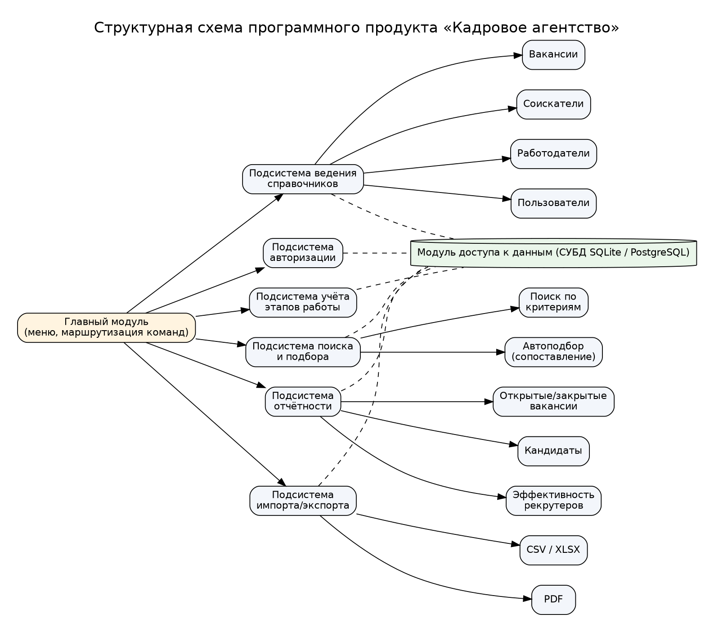
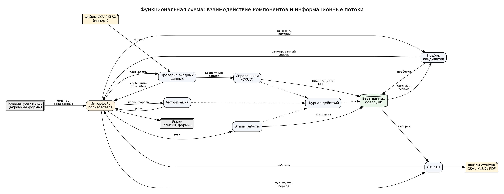
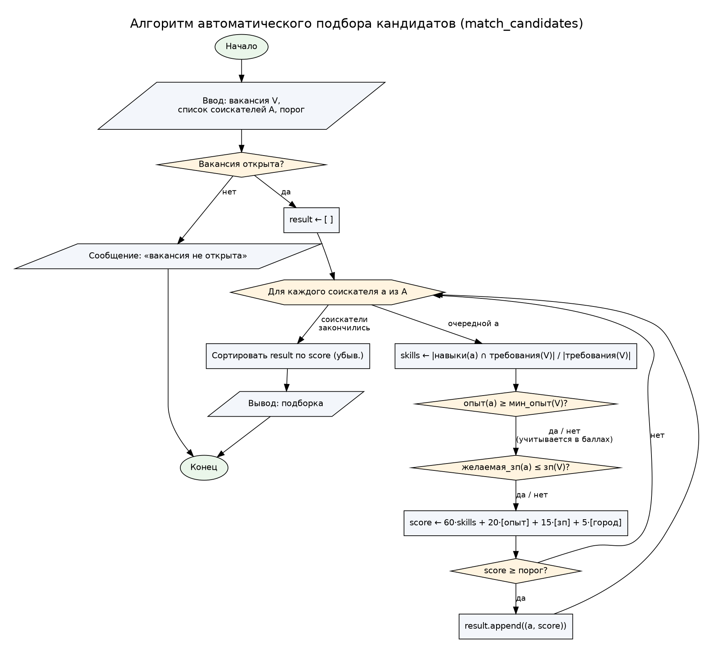
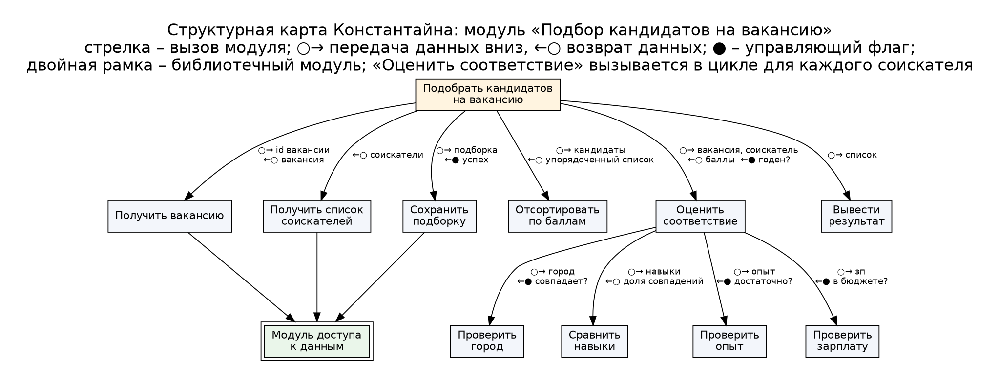
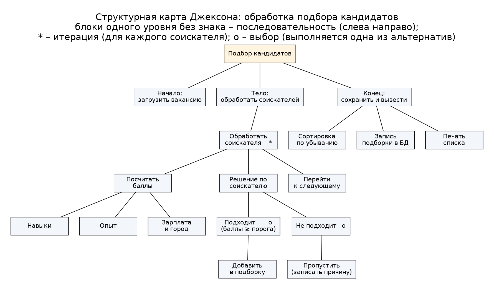

# Практическая работа № 3. Задание 2. Технический проект

**Программный комплекс «Кадровое агентство»**, модуль «Подбор кандидатов на вакансию».  
Основание: ТЗ (работа № 2) и эскизный проект ([03_Sketch_Project.md](03_Sketch_Project.md)).  
Разработал: Лаптев В.И., группа 3ИП7-24.

## 1. Ведомость технического проекта

| № | Документ | Файл |
|---|---|---|
| 1 | Пояснительная записка | этот документ |
| 2 | Структурная схема программного продукта | [diagrams/structure.png](diagrams/structure.png) |
| 3 | Функциональная схема | [diagrams/functional.png](diagrams/functional.png) |
| 4 | Алгоритм программы (модуль подбора) | [diagrams/algorithm.png](diagrams/algorithm.png) |
| 5 | Структурная карта Константайна | [diagrams/constantine.png](diagrams/constantine.png) |
| 6 | Структурная карта Джексона | [diagrams/jackson.png](diagrams/jackson.png) |

## 2. Структурная схема

Структурная схема отражает состав программного продукта и подчинённость частей по управлению.
Главный модуль вызывает шесть подсистем; все подсистемы работают с данными только через модуль
доступа к данным (пунктир), что позволяет заменить SQLite на PostgreSQL без изменения логики.

## 3. Функциональная схема

Функциональная схема показывает взаимодействие компонентов и информационные потоки: что
вводится, какие данные передаются между компонентами, какие файлы и устройства используются.

| Поток | Состав данных | Носитель |
|---|---|---|
| Ввод пользователя | логин, пароль; поля форм справочников; критерии поиска | клавиатура, мышь |
| Импорт | записи соискателей и вакансий | файлы CSV / XLSX |
| Справочники → БД | INSERT / UPDATE / DELETE записей | файл БД `agency.db` (SQLite) или сервер PostgreSQL |
| БД → Подбор | открытая вакансия, резюме соискателей | оперативная память |
| Подбор → интерфейс | ранжированный список (соискатель, балл) | экран |
| Отчёты → файлы | таблицы отчётов | CSV / XLSX / PDF |
| Журнал | кто, когда, какое действие | таблица `audit_log` |

## 4. Алгоритм программы

Модуль подбора разработан методом пошаговой детализации (нисходящее проектирование).

**Шаг 1 (укрупнённо):** получить вакансию → оценить каждого соискателя → отобрать и упорядочить → сохранить подборку.

**Шаг 2 (детализация оценки):** балл соискателя складывается из четырёх критериев:

| Критерий | Вес | Как вычисляется |
|---|---|---|
| Навыки | 60 | доля требований вакансии, которые есть у соискателя (регистр не учитывается) |
| Опыт | 20 | 20, если опыт ≥ минимального опыта вакансии, иначе 0 |
| Зарплата | 15 | 15, если желаемая зп ≤ зп вакансии, иначе 0 |
| Город | 5 | 5, если город соискателя совпадает с городом вакансии, иначе 0 |

Итоговый балл округляется до целого (0–100). Соискатель попадает в подборку, если балл ≥ порога
(по умолчанию 50). Список сортируется по убыванию балла, при равенстве – по ФИО.

**Шаг 3 (блок-схема):**

Пример расчёта. Вакансия «Python-разработчик»: требования {python, sql, git}, опыт ≥ 2, зп 120 000,
Москва. Соискатель: навыки {python, git, docker}, опыт 3, желаемая зп 110 000, Москва →
навыки 2/3 · 60 = 40, опыт 20, зп 15, город 5 → **80 баллов**, проходит порог.

## 5. Структурная карта Константайна

Карта описывает отношения между модулями: какой модуль кого вызывает и какие данные (○) и
управляющие флаги (●) передаются при вызове.

## 6. Структурная карта Джексона

Карта Джексона показывает соответствие структуры программы структуре обрабатываемых данных:
поток соискателей обрабатывается итерацией (*), решение по каждому – выбором (o).

## 7. Технический проект программного модуля «Подбор кандидатов»

| Параметр | Значение |
|---|---|
| Назначение | автоматическое формирование подборки соискателей на открытую вакансию |
| Язык, версия | Python 3.10+ |
| Вызов | `agency.match_candidates(vacancy, threshold=50) -> list[tuple[Applicant, int]]` |
| Входные данные | вакансия (статус, требования, мин. опыт, зп, город), список соискателей, порог |
| Выходные данные | список пар (соискатель, балл), отсортированный по убыванию балла |
| Ошибки | `ValueError`, если вакансия не открыта или порог вне 0–100 |
| Используемые модули | модель данных (классы работы № 4), модуль доступа к данным |
| Сложность | O(N · K), N – число соискателей, K – число требований |
| Надёжность | функция не изменяет входные данные; проверяется модульными тестами |
| Реализация | [`hr_agency/agency.py`](../agency.py), тесты – [`hr_agency/tests`](../tests) (работа № 4) |

Перечень входных документов: анкета соискателя, заявка работодателя на вакансию, учётные данные
пользователя. Выходные документы: подборка кандидатов, отчёт по открытым вакансиям, отчёт по
кандидатам, отчёт об эффективности рекрутеров.

Используемое ПО: Windows 10/11 или Linux; Python 3.10+; SQLite 3 / PostgreSQL 14+; Git.
Технические средства – по ТЗ (Core i3, 4 ГБ ОЗУ, 2 ГБ диска, монитор 1366×768).

Проектная оценка надёжности: наиболее надёжны модули справочников (простые CRUD-операции с
проверкой полей); узкие места – импорт из внешних файлов (непредсказуемый формат – нужна
построчная проверка с отчётом об ошибках) и автоподбор (качество зависит от того, насколько
единообразно записаны навыки – предусмотрено приведение к нижнему регистру и словарь синонимов во
второй очереди).
