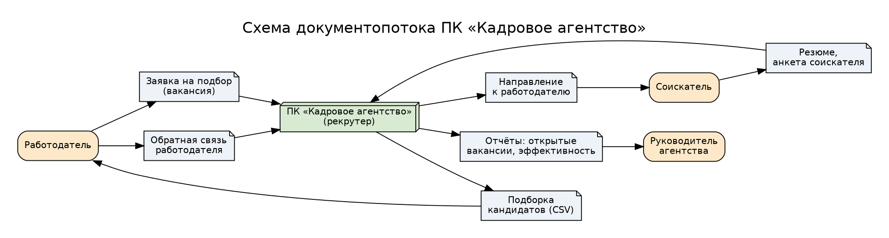
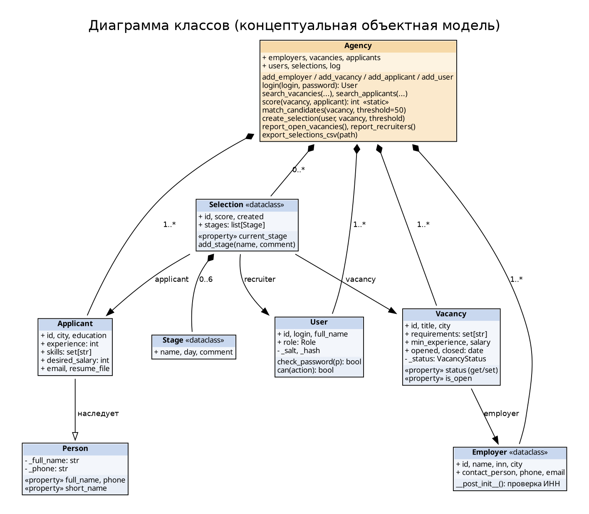

# Практическая работа № 4. Объектно-ориентированное проектирование ПК «Кадровое агентство»

**Цель работы:** применение методов объектно-ориентированного проектирования.

**Задание:** для предметной области, выбранной в практической работе № 1 (кадровое агентство),
выполнить объектно-ориентированное проектирование: проанализировать предметную область, определить
функции системы, построить схему документопотока, выделить сущности, их атрибуты и связи, построить
концептуальную (объектную) модель, определить входные и выходные данные. По аналогии с примером
методички (класс `Class1` «Автомобили» с полями, методами и свойствами `Property Get/Let`) создать
классы, экземпляры классов и пример использования их компонентов.

Реализация выполнена на Python 3.10+ (язык проекта SportShop) вместо Visual Basic 6: свойства
`Property Get / Property Let` реализованы через декоратор `@property` и `@<имя>.setter`.

## 1. Анализ предметной области

Кадровое агентство — посредник между **работодателями**, которым нужны сотрудники, и
**соискателями**, которые ищут работу. Работодатель передаёт заявку (вакансию) с требованиями
(навыки, минимальный опыт, город, заработная плата). Соискатель передаёт резюме. **Рекрутер**
агентства подбирает кандидатов, ведёт их по этапам (первичный контакт → интервью → тестирование →
направление к работодателю → обратная связь → приём на работу) и при успешном найме закрывает вакансию.
**Руководитель** контролирует работу по отчётам, **администратор** ведёт пользователей и справочники.
Подробный анализ — в `01_Domain_Analysis.md`, требования — в `02_Technical_Specification.md`,
архитектура — в `03_Sketch_Project.md` и `03_Technical_Project.md`.

## 2. Функции системы

| № | Функция | Реализация (класс.метод) |
|---|---------|--------------------------|
| 1 | Авторизация пользователей с ролями | `Agency.login`, `User.check_password`, `User.can` |
| 2 | Учёт работодателей (проверка ИНН и дубликатов) | `Agency.add_employer`, `Employer.__post_init__` |
| 3 | Учёт вакансий и их статусов | `Agency.add_vacancy`, `Vacancy.status` (get/set) |
| 4 | Учёт соискателей (проверка ФИО, телефона, email, опыта) | `Agency.add_applicant`, `Person.full_name/phone` |
| 5 | Поиск вакансий и соискателей по критериям | `Agency.search_vacancies`, `Agency.search_applicants` |
| 6 | Автоматический подбор кандидатов (балл 0–100) | `Agency.score`, `Agency.match_candidates` |
| 7 | Формирование подборок рекрутером | `Agency.create_selection` |
| 8 | Ведение этапов работы с кандидатом | `Selection.add_stage`, `Selection.current_stage` |
| 9 | Отчёты (открытые вакансии, эффективность рекрутеров) | `Agency.report_open_vacancies`, `Agency.report_recruiters` |
| 10 | Выгрузка подборок в CSV для работодателя | `Agency.export_selections_csv` |

## 3. Схема документопотока



Входящие документы: заявка работодателя на подбор, резюме/анкета соискателя, обратная связь работодателя.
Исходящие документы: подборка кандидатов (CSV), направление соискателя к работодателю, отчёты руководителю.

## 4. Сущности, атрибуты и связи

| Сущность (класс) | Атрибуты | Связи |
|------------------|----------|-------|
| Работодатель (`Employer`) | id, name, inn (10/12 цифр), city, contact_person, phone, email | 1 : N с Вакансией |
| Вакансия (`Vacancy`) | id, employer, title, city, requirements, min_experience, salary, opened, closed, status | N : 1 с Работодателем; 1 : N с Подборкой |
| Человек (`Person`, базовый) | full_name, phone | базовый класс для Соискателя |
| Соискатель (`Applicant`) | id, city, education, experience, skills, desired_salary, email, resume_file | наследует Person; 1 : N с Подборкой |
| Пользователь (`User`) | id, login, role, full_name, _salt, _hash | 1 : N с Подборкой (рекрутер) |
| Подборка (`Selection`) | id, vacancy, applicant, recruiter, score, created, stages | связывает Вакансию, Соискателя и Рекрутера; 1 : N с Этапом |
| Этап (`Stage`) | name, day, comment | N : 1 с Подборкой (композиция) |
| Агентство (`Agency`) | name, employers, vacancies, applicants, users, selections, log | агрегирует все объекты |

Перечисления: `VacancyStatus` (открыта / приостановлена / закрыта), `Role` (администратор / руководитель / рекрутер).

## 5. Концептуальная (объектная) модель



Принципы ООП в модели:

* **Инкапсуляция** — закрытые поля `_full_name`, `_phone`, `_status`, `_hash`; изменение только через
  свойства с проверкой (аналог `Property Let`), пароль недоступен в открытом виде.
* **Наследование** — `Applicant` наследует `Person` (ФИО, телефон, `short_name`).
* **Полиморфизм / сообщения** — объекты взаимодействуют вызовами методов: `Selection.add_stage("приём на
  работу")` посылает сообщение вакансии и меняет её состояние на «закрыта».
* **Композиция/агрегация** — `Agency` хранит все объекты, `Selection` владеет списком `Stage`.

## 6. Входные и выходные данные

| Входные данные | Источник | Проверка |
|----------------|----------|----------|
| Логин и пароль | пользователь | пароль ≥ 6 символов, сверка хэша SHA-256 с солью |
| Данные работодателя | заявка | ИНН 10 или 12 цифр, уникальность ИНН |
| Данные вакансии | заявка | зарплата > 0, работодатель должен существовать |
| Резюме соискателя | соискатель | ФИО ≥ 2 слов, телефон 11 цифр (нормализуется в +7…), опыт ≥ 0, зарплата > 0, формат email, уникальный телефон |
| Порог подбора | рекрутер | 0–100, вакансия должна быть открыта |
| Название этапа | рекрутер | только следующий этап по порядку |

| Выходные данные | Получатель |
|-----------------|------------|
| Список кандидатов с баллами (по убыванию балла, затем по ФИО) | рекрутер |
| Файл `selections.csv` (id; вакансия; соискатель; балл; этап; рекрутер) | работодатель |
| Отчёт «Открытые вакансии» (работодатель, вакансия, зарплата) | руководитель |
| Отчёт «Эффективность рекрутеров» (ФИО, подборок, приёмов, конверсия %) | руководитель |
| Журнал действий (входы, подборки) | администратор |
| Сообщения об ошибках ввода и прав доступа | пользователь |

## 7. Создание объектов и пример использования

Код классов — `hr_agency/agency.py`, пример использования — `hr_agency/demo.py`, тесты — `hr_agency/tests/test_agency.py`.

```bash
python hr_agency/demo.py
python -m unittest discover -s hr_agency/tests -t .
```

Сценарий демонстрации: создаётся агентство и три пользователя, рекрутер входит в систему, добавляются
2 работодателя, 2 вакансии и 4 соискателя; выполняется поиск, автоподбор на вакансию «Python-разработчик»
(Иванов И.И. и Сидорова М.О. — по 80 баллов), лучший кандидат проводится через все 6 этапов, после чего
вакансия автоматически закрывается; демонстрируются ошибки (пропуск этапа, недостаток прав руководителя,
некорректное ФИО), отчёты, выгрузка CSV и журнал.

## 8. Сопоставление с примером методички

| Пример «Автомобили» (VB6) | ПК «Кадровое агентство» (Python) |
|---------------------------|----------------------------------|
| Модуль класса `Class1` | классы `Person`, `Applicant`, `Employer`, `Vacancy`, `User`, `Selection`, `Stage`, `Agency` |
| Поля `avto, firma, model, stoim, pict` | атрибуты экземпляров (`title`, `salary`, `skills` …) |
| `Private Sub Class_Initialize()` | конструктор `__init__` / `__post_init__` |
| `Public Function Met1()…Met4()` | методы `match_candidates`, `create_selection`, `add_stage`, `report_*` |
| `Property Get / Property Let varian` | `@property status` / `@status.setter` |
| `Dim av As New Class1` | `agency = Agency("…")`, `Vacancy(1, techsoft, …)` |
| Реакция формы на выбор пользователя | вывод результатов и сообщений об ошибках в `demo.py` |
